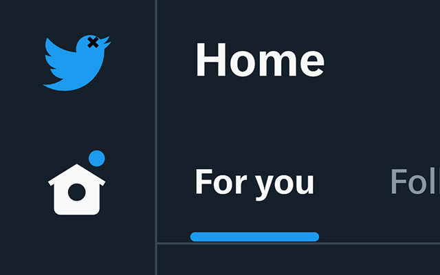

<h1>It's not dead, it's resting </h1>

Browser extension to replace the 𝕏 logo in twitter.com with a bird.

Replaces the logo in:

- Mobile and desktop site headers
- Loading screen
- [Favicon] (shown on browser tabs and bookmarks)
- TweetDeck loading screen
- TweetDeck favicon

Uses CSS to replace the images, so it doesn't impact performance, and the images are replaced instantly instead of flashing the original image.

[favicon]: https://en.wikipedia.org/wiki/Favicon

https://github.com/slikts/riptwitter/assets/137872/15efdd89-7da5-4f58-a25f-7afdf53405af

## Installation

### Chrome Web Store

Pending review.

### Manual

1. Download [the latest release](https://github.com/slikts/riptwitter/releases)
2. Open the Chrome extensions page (`about:extensions`)
3. Drag over the `.zip` file
